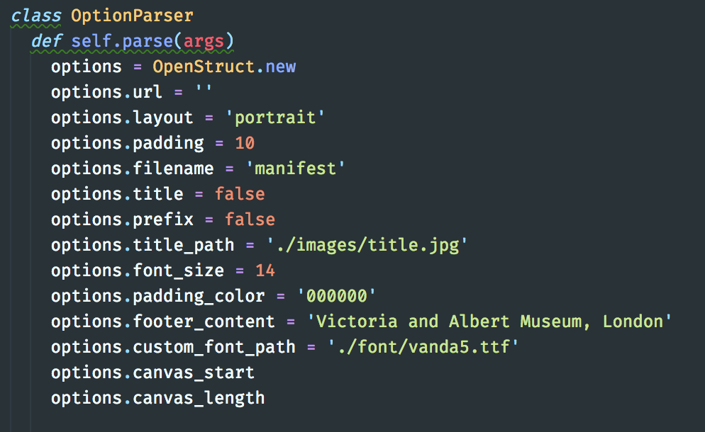

Cocktail - IIIF Manifest to PDF Generator
-----

This program takes a url input from a triple IIIF manifest and converts to a pdf document with some 'minimal' styling options.
You caan set defaults within the `lib\cocktail' executable file



It uses the excellent prawnpdf gem and additionalt functionality can be added with reference to the Prawn manual.
[Prawn manual](http://prawnpdf.org/manual.pdf)
[Prawn Documentation](http://prawnpdf.org/docs/0.11.1/Prawn/Document.html)

extract_IIIF.rb
===

This will identify the relevant Manifest version (2 or 3) and run the appropriate iteration.

To Use:
---

- Install dependencies `bundle install`
- You can start the Command Line Interface (CLI) with `bin/cocktail` with flags appended for specific options. 
- -u followed by manifest URL is the only required argument the rest will run with default options.

CLI Options:

- -a folio prefix (default = false). This adds 'ff.' in front of digits in image label if they match this regex /^\d+[vr]/
- -b left footer content. Starts with copyright symbol followed by the footer content.
- -c fill colour for image padding (default is black).
- -d fontpath. Path to custom ttf file (not required)
- -f Filename (default = manifest)
- -h help
- -i path to title page (default = /images/title.jpg) overwite this with your specific title image or add a specific path to the image
- -j array start. First argument for range printing (not required)
- -k array length. Second argument for range printing (not required)
- -l Landscape or Portrait (this will autocomplete so l or p will suffice. Portrait is default)
- -p Additional Padding (default = 10)
- -s Font size (default = 14)
- -t include title page (default = false)
- -u URL (Required)
- -v --configfile PATH (you can specify the path to a YAML file holding the default options)

Example CLI instructions for V3  
`bin/cocktail -u https://iiif.vam.ac.uk/collections/MSL:1876:Forster:141:I/manifest.json -l po -f v3test -t -s 14`

Or using the config file:
`bin/cocktail -u https://iiif.vam.ac.uk/collections/MSL:1876:Forster:141:I/manifest.json -v config.yaml`


Example CLI instructions for V2  
`bin/cocktail -u https://iiif-int.vam.ac.uk/collections/MSL:1861:7446/manifest.json -l lan -f v2test -t -s 14`

Example Manifests:

V2 (best landscape) = https://iiif-int.vam.ac.uk/collections/MSL:1861:7446/manifest.json  
V3 (best portrait) = https://iiif.vam.ac.uk/collections/MSL:1876:Forster:141:I/manifest.json

Example configuration file:

```
layout: 'landscape'
title: true
title_path: './images/title.jpg'
footer_content: 'Hello from config file'
```

To test (automated but incomplete):
---

- run `rspec` for coverage and unit tests

To test (manual end to end):
---

For V3 Manifest:  

```
test3 = Cocktail.new('https://iiif.vam.ac.uk/collections/MSL:1876:Forster:141:I/manifest.json', 'portrait', 0, 14)  
test3.extract  
test3.insert_title  
test3.full_page_generation  
puts test3.manifest_version  
test3.save_as('v3test.pdf')  
```

For V2 Manifest:  

```
test2 = Cocktail.new('https://iiif-int.vam.ac.uk/collections/MSL:1861:7446/manifest.json', 'landscape', 0)  
test2.extract  
test2.insert_title  
test2.full_page_generation  
puts test2.manifest_version  
test2.save_as('v2test.pdf')  
```

Shout Outs
===

- How to colour a page in prawnpdf using this technique to [stroke a bounding box](https://stackoverflow.com/questions/17757298/how-to-add-background-fill-color-to-a-bounding-box-in-prawn).
- Using a [configuration file with optparse](https://stackoverflow.com/questions/4375530/ruby-configuration-file-parser-combined-with-optionparser)
